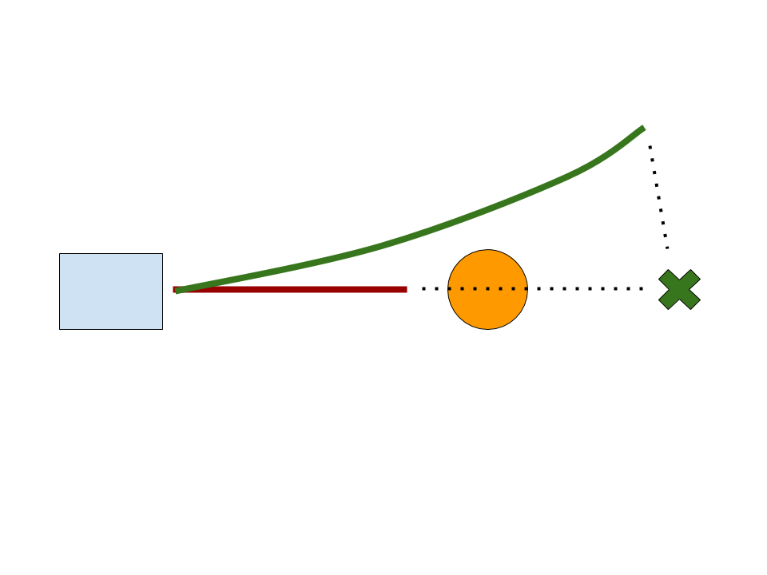
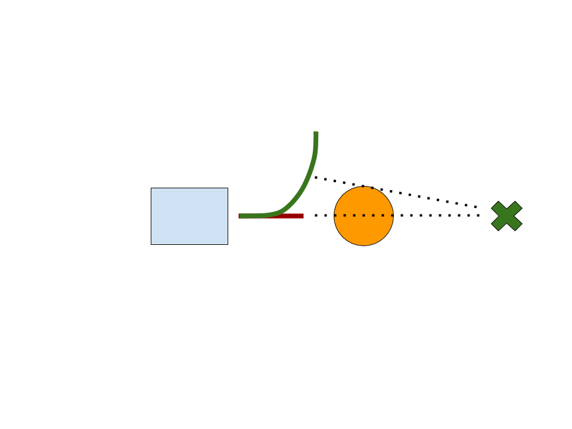

# Checkpoint 1.3 Progress Report

Logan Zartman

Austin Atchley

## 1. Mathematical computation:
## 1-D time optimal controller:
1. Time integration
    1. Compute straight-line distance traveled since last time step
    2. Compute velocity as distance / timestep size
    3. Update distance (total traveled) using explicit Euler integration
2. State prediction in 3 timeframes: last sensor read (*S*), predicted at current time (*C*), predicted at motor actuation (*A*)
    1. Let speed\_S = norm(velocity)
    2. Let position\_S = distance
    3. Compute speed\_C and position\_C using kinematics with last acceleration output and estimated sensor→control latency
    4. Compute speed\_A and position\_A using kinematics with estimated control→actuation latency
    5. Estimate stopping position using estimated state at actuation
3. Motion
    1. Check estimated stopping position against target position
    2. If stopping position >= target position then
        1. Compute required deceleration to stop at target
        2. Apply deceleration
    3. Else accelerate at max acceleration

### LIDAR to point cloud computation:
for each point in point cloud:
    theta_i = theta_0 + i * theta_increment
    p_i = {r_i * cos(theta_i), r_i * sin(theta_i)}

### Obstacle detection computation:
1. Given command line flags for max distance and curvature
2. Assuming we already have the point cloud constructed
3. Free path length = max distance
4. Iterating through all points in point cloud:
    1. If point is not an obstacle (using formula presented in slides), skip.
    2. Find minimum of free path length with this point, and the free path length so far
5. Add free path length to our current position to get target position
6. Run 1-D TOC with our current position and this target position

### Obstacle avoidance reward function:

We calculate the obstacle avoidance reward for each path with the following:

```
R(c) = free_path_length(c) + (free_path_length^2 * clearance(c) * clearance_weight) + (distance_to_target * distance_weight)
```

See Section 3 for explanation.

### Obstacle avoidance integration:

We optimize the function on the interval of possible curvatures at each timestep by performing a naive search with a set number of discrete steps. After choosing the best curvature, we perform a [Golden Section Search](https://en.wikipedia.org/wiki/Golden-section_search) on the interval surrounding the best curvature.


## 2. Code organization:

`Run()` computes robot motion each frame using the following logic:

- Call `get_best_curvature()` to find the optimal path
    - Search the interval of possible curvatures in a discrete number of steps. For each curvature, call `path_score()` to evaluate it
        - Compute free path length using `get_free_path_length()`
        - Compute distance from `closest_approach()` to goal
        - Compute clearance using `get_clearance()`
        - Combine weighted factors into resulting score
    - Refine the best curvature using golden section search
- Call `perform_toc()` to update time optimal controller state given new parameters


## 3. Parameter tuning:

We tuned our parameters primarily through trial and error. We put a lot of effort into visualization up front, and it paid off in the end because we could see exactly what our car was choosing to do. The values we settled on were the following:

- clearance_weight: 8
- distance_weight: -0.1

We increased clearance_weight until the car avoided the cones that we used for testing. After this, we did more fine-tuning on distance_weight. We found that values that were too high forced us to run into obstacles head-on. Our theory is that this was because when we are close to obstacles, a sharp turn is necessary to avoid the obstacle. Such a sharp turn would increase the free path length, but because this turn is very sharp, the distance to target also increases.

{ width=250px }
{ width=250px }

*Left: Good avoidance scenario; the avoiding path reduces distance to goal. Right: Bad avoidance scenario; the avoiding path does not reduce distance to goal.*

Additionally, the clearance of the straight line path is often very high compared to an avoiding path which more narrowly misses the obstacle. This compounds with the issue that the avoiding path may have an increased or equivalent distance to target, and often causes the score to favor the straight path.

Because of this phenomenon, we decided to alter the scoring function. We multiply the clearance by the free path length squared in order to discourage the car from moving into a position with high clearance and low free path length (i.e. straight into a wall). Raising the free path length to a power causes the clearance term to decrease more extremely as the free path length decreases.

## 4. Challenges faced:

We were not sure if our bugs were logic errors or incorrect tunings of parameters for most of the development time. On top of this, we were tuning in several dimensions concurrently.

## 5. Contributions of each team member:

Austin - Parameter tuning, implementation of Golden Section Search, structure of general approach

Logan - Parameter tuning, visualization, implementation of _get_best_curvature.

All mission-critical code was pair-programmed, with Logan primarily committing.

## 6. GitHub Repo
[https://github.com/austinatchley/F1-10-Autonomous-Driving](https://github.com/austinatchley/F1-10-Autonomous-Driving)

## 7. Video Demos

[Video demo of slalom](https://photos.app.goo.gl/88f5tYdzNYGxQoLw9)

## 8. Future improvements:

We would like to make the joystick move the 'carrot.' We would also like to use a better score function if there is one. We will do some research on the topic.
